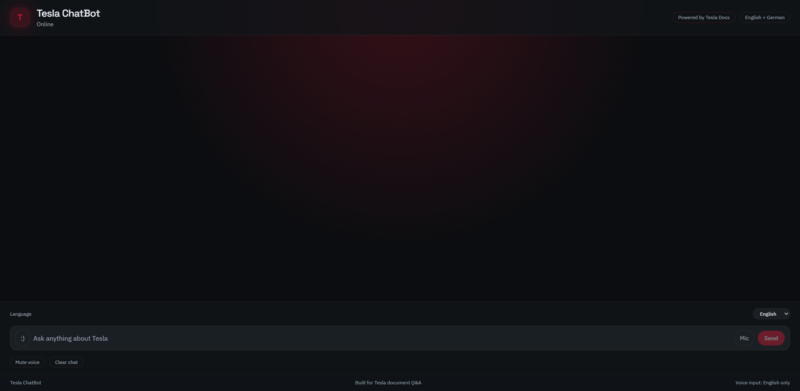
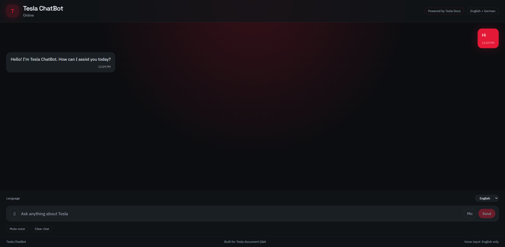
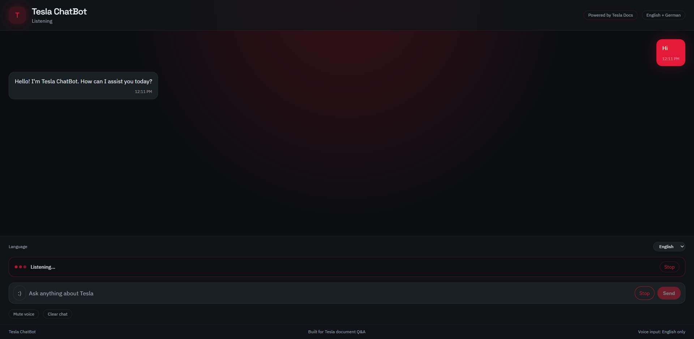
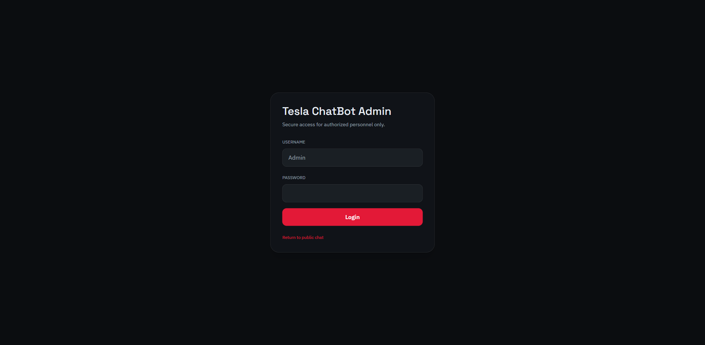
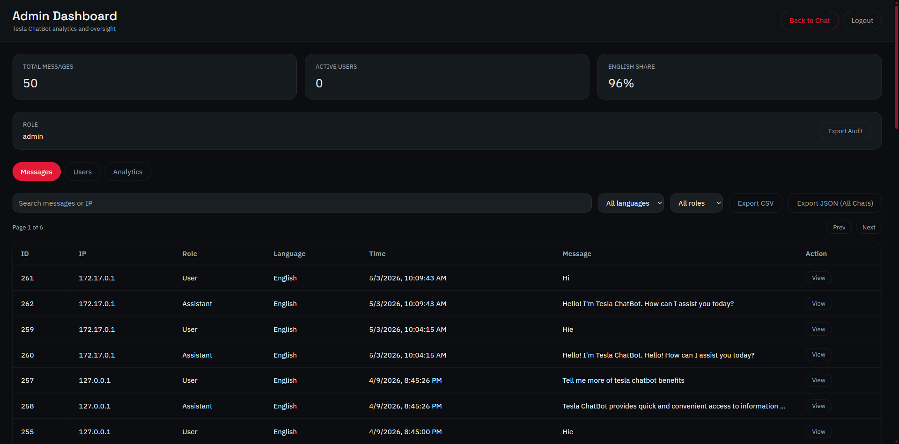
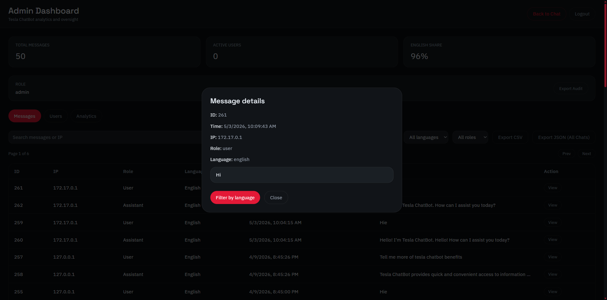
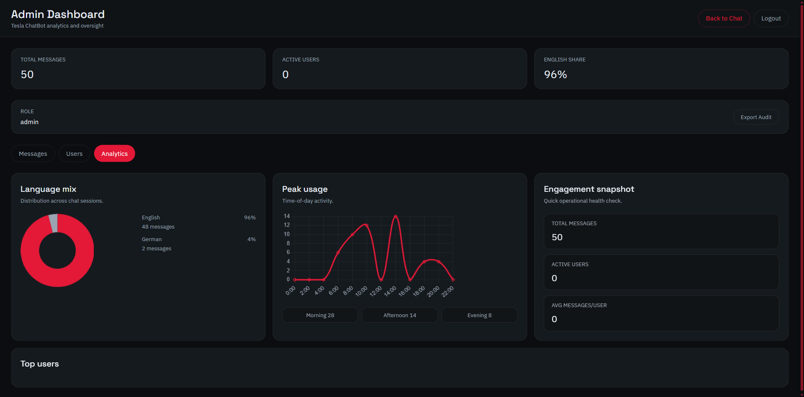

# Tesla ChatBot

Tesla ChatBot is a full-stack Retrieval-Augmented Generation (RAG) application for Tesla document question answering. It uses Tesla PDF content as the primary source of truth, falls back to general Tesla knowledge when the documents do not contain enough context, and provides an admin dashboard for reviewing usage, exports, audit logs, and analytics.

The application is built as two containerized services:

- `backend`: FastAPI API, SQLite persistence, PDF ingestion, retrieval, admin auth, audit logging, and rate limiting.
- `frontend`: React, Vite, Tailwind CSS public chat UI and admin dashboard.

## Highlights

- PDF-first Q&A using text extracted from `backend/pdfs/`.
- TF-IDF retrieval pipeline with optional FAISS acceleration.
- English and German chat support.
- English-only browser voice input.
- Admin dashboard with message review, user views, analytics charts, CSV/JSON exports, and audit exports.
- Token-based admin access with role separation for admin and viewer users.
- Environment-driven runtime configuration.
- Docker support for backend and frontend services.

## Screenshots

### Public Chat



### Chat Response



### Voice Listening



### Admin Login



### Admin Dashboard



### Message Details



### Analytics



## Tech Stack

| Layer | Technology |
| --- | --- |
| Frontend | React, Vite, Tailwind CSS |
| Charts | Chart.js, react-chartjs-2 |
| Backend | FastAPI, Uvicorn |
| Database | SQLite |
| LLM | OpenAI ChatCompletion API |
| Retrieval | scikit-learn TF-IDF, optional FAISS |
| PDF Parsing | PyMuPDF |
| Runtime | Docker |

## System Flow

1. Backend starts and loads all PDFs from `backend/pdfs/`.
2. PDF text is split into chunks and indexed with TF-IDF.
3. A user sends a message to `POST /chat?language=english|german`.
4. The retriever selects relevant Tesla document chunks.
5. The chat service builds a prompt from the retrieved context and user message.
6. The assistant returns an answer in English, then translates to German when requested.
7. Chat messages are stored in SQLite for admin review and exports.
8. Admin activity is recorded in the audit log.

## Project Structure

```text
backend/
  app/
    core/
      config.py              # Environment variable loading and app settings
      database.py            # SQLite setup and shared connection helpers
      logging_config.py      # Logging configuration
      pdf_store.py           # PDF text extraction
      rate_limit.py          # IP-based request throttling
    routes/
      admin.py               # Admin auth, exports, audit, and dashboard APIs
      chat.py                # Public chat endpoint
    services/
      admin_auth.py          # Token issuing, validation, and role lookup
      audit.py               # Admin action logging
      chat_service.py        # Prompt construction and LLM orchestration
      retriever.py           # TF-IDF retrieval and optional FAISS support
      translator.py          # German translation support
    schemas.py               # Pydantic request models
    main.py                  # FastAPI app setup and startup hooks
  pdfs/                      # Tesla PDF knowledge base
  .env.example               # Backend configuration template
  Dockerfile
  main.py                    # Uvicorn entrypoint
  requirements.txt

frontend/
  src/
    components/
      admin/                 # Admin dashboard components
      public/                # Public chat components
    hooks/                   # Shared React hooks
    lib/                     # API and constants
    App.jsx
    main.jsx
    index.css
  .env.example               # Frontend configuration template
  Dockerfile
  package.json
  vite.config.cjs
```

## Configuration

Create `backend/.env` from `backend/.env.example` and set the runtime values for your environment.

```env
OPENAI_API_KEY=your_openai_key
OPENAI_MODEL=gpt-3.5-turbo
ADMIN_PASSWORD=change_me
VIEWER_PASSWORD=
ADMIN_TOKEN_TTL_MINUTES=120
CORS_ALLOW_ORIGINS=*
ENVIRONMENT=development
REQUEST_TIMEOUT_SECONDS=30
RATE_LIMIT_REQUESTS=30
RATE_LIMIT_WINDOW_SECONDS=60
```

Optional frontend environment:

```env
VITE_API_BASE_URL=http://localhost:8000
```

Do not commit real `.env` files. The repository ignores `backend/.env`, local databases, virtual environments, node modules, and generated exports.

## Run Locally

### Backend

```powershell
cd backend
python -m venv .venv
.\.venv\Scripts\activate
pip install -r requirements.txt
uvicorn main:app --reload --port 8000
```

### Frontend

```powershell
cd frontend
npm install
npm run dev
```

Open:

- Public chat: `http://localhost:5173/`
- Admin dashboard: `http://localhost:5173/admin`
- Backend health check: `http://localhost:8000/health`

If PowerShell blocks scripts, run the same commands through `cmd /c`.

## Run With Docker

### Backend

```powershell
cd backend
docker build -t tesla-chatbot-backend .
docker run --name tesla-chatbot-backend -p 8000:8000 --env-file .env tesla-chatbot-backend
```

### Frontend

```powershell
cd frontend
docker build -t tesla-chatbot-frontend .
docker run --name tesla-chatbot-frontend -p 5173:5173 -e VITE_API_BASE_URL=http://localhost:8000 tesla-chatbot-frontend
```

If ports `8000` or `5173` are already in use, map the services to different host ports. Example:

```powershell
docker run --name tesla-chatbot-backend -p 8001:8000 --env-file .env tesla-chatbot-backend
docker run --name tesla-chatbot-frontend -p 5174:5173 -e VITE_API_BASE_URL=http://localhost:8001 tesla-chatbot-frontend
```

Then open `http://localhost:5174/`.

## API Reference

### Public

| Method | Endpoint | Purpose |
| --- | --- | --- |
| `GET` | `/health` | Backend health check |
| `POST` | `/chat?language=english\|german` | Submit a chat message |

Chat request body:

```json
{
  "message": "What is Tesla Autopilot?"
}
```

### Admin

| Method | Endpoint | Role | Purpose |
| --- | --- | --- | --- |
| `POST` | `/admin/login` | Public | Issue an admin or viewer token |
| `GET` | `/admin/messages` | Viewer/Admin | Paginated message list |
| `GET` | `/admin/users` | Viewer/Admin | Paginated user list |
| `GET` | `/admin/export/messages` | Viewer/Admin | Export messages as CSV |
| `GET` | `/admin/export/messages-json` | Viewer/Admin | Export messages as JSON |
| `GET` | `/admin/export/users` | Viewer/Admin | Export users as CSV |
| `GET` | `/admin/audit` | Admin | View admin audit logs |
| `GET` | `/admin/export/audit` | Admin | Export audit logs as CSV |
| `POST` | `/admin/fix-database` | Admin | Repair legacy message language data |

Admin-protected requests use the issued token in the `x-admin-token` header.

## Admin Access

The login screen includes a username field for the UI, but the backend authenticates by password only.

- Admin password: value of `ADMIN_PASSWORD`.
- Viewer password: value of `VIEWER_PASSWORD`, when configured.
- Token lifetime: `ADMIN_TOKEN_TTL_MINUTES`.

After changing passwords or token settings, restart the backend service.

## Database

SQLite is used for local persistence.

| Table | Purpose |
| --- | --- |
| `messages` | Stores chat messages, roles, language, timestamp, and IP metadata |
| `users` | Stores basic tracked user metadata |
| `admin_audit` | Stores admin login and privileged action history |

Primary database file:

```text
backend/chat_data.db
```

Database files are intentionally ignored by git.

## Knowledge Base

PDF files in `backend/pdfs/` are loaded at backend startup. To update the knowledge base:

1. Add or replace PDF files in `backend/pdfs/`.
2. Restart the backend service.
3. Confirm `GET /health` returns `{"status":"ok"}`.

The current retriever uses TF-IDF. FAISS can be added for faster similarity search on larger document sets.

## Security Notes

- Never commit real API keys or production passwords.
- Use strong values for `ADMIN_PASSWORD` and `VIEWER_PASSWORD`.
- Restrict `CORS_ALLOW_ORIGINS` in production instead of using `*`.
- SQLite is suitable for this project scope, but a production multi-instance deployment should use an external database.
- Admin tokens are stored in memory, so restarting the backend invalidates existing sessions.

## Implemented Capabilities

- Clean FastAPI layering across `core`, `routes`, and `services`.
- Environment-based configuration.
- PDF ingestion and retrieval-backed prompt construction.
- English and German chat support.
- Rate limiting middleware.
- Health endpoint.
- SQLite chat, user, and audit persistence.
- Admin and viewer roles.
- CSV and JSON exports.
- Dashboard analytics with charts.
- Dockerized frontend and backend.

## Future Improvements

- Replace or supplement TF-IDF with a vector database.
- Add streaming responses for lower perceived latency.
- Move admin token storage to a persistent session store.
- Add automated backend and frontend tests.
- Add Docker Compose for one-command local startup.
